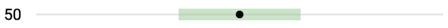

# [`react-meter-chart`](https://www.npmjs.com/package/react-meter-chart)


[](https://codecov.io/gh/morganney/react-meter-chart)
[](https://www.npmjs.com/package/react-meter-chart)

React component to render an element very much like an [HTML &lt;meter&gt;](https://developer.mozilla.org/en-US/docs/Web/HTML/Element/meter). Basically a reason to improve the [answer from a stackoverflow question](https://stackoverflow.com/questions/73961347/range-line-component-in-react/73999120#73999120).



See the [demo](https://morganney.github.io/react-meter-chart).

## Getting Started

First install `react-meter-chart`:

```console
npm install react-meter-chart
```

Next include it in your React app:

```jsx
import React from 'react'
import { createRoot } from 'react-dom/client'
import { MeterChart } from 'react-meter-chart'

const root = createRoot(document.getElementById('root'))

root.render(
  <main>
    <MeterChart value={50} low={35} high={65} />
  </main>
)
```

## Example

Check out the demo at https://morganney.github.io/react-meter-chart.

### CDN with Import Map

You can skip a build step completely by placing this inside of your Vite project's `dist` directory to quickly preview with `vite preview`.

**index.html**

```html
<!doctype html>
<html lang="en">
  <head>
    <meta charset="UTF-8" />
    <meta name="viewport" content="width=device-width, initial-scale=1.0" />
    <script type="importmap">
      {
        "imports": {
          "react": "https://esm.sh/react",
          "react-dom/": "https://esm.sh/react-dom/",
          "styled-components": "https://esm.sh/styled-components",
          "react-meter-chart": "https://esm.sh/react-meter-chart",
          "htm/": "https://esm.sh/htm/"
        }
      }
    </script>
    <title>CDN with Import Map: react-meter-chart</title>
  </head>
  <body>
    <div id="root"></div>
    <script type="module">
      import { createRoot } from 'react-dom/client'
      import { MeterChart } from 'react-meter-chart'
      import { html } from 'htm/react'

      createRoot(document.getElementById('root')).render(
        html`
          <${MeterChart} value=${50} low=${45} high=${65} />
        `
      )
    </script>
  </body>
</html>
```

Now navigate to http://localhost:4173.

### Vite build

To use it with a Vite build just import the component from this package.

For instance, using a new Vite project, create an `src/App.tsx` file:

**src/App.tsx**

```jsx
import { MeterChart } from 'react-meter-chart'

function App() {
  return (
    <main>
      <MeterChart value={50} low={35} high={65} />
    </main>
  )
}

export default App
```

Also, remove the default styles from `src/main.tsx`:

```diff
import React from 'react'
import ReactDOM from 'react-dom/client'
import App from './App.tsx'
- import './index.css'

ReactDOM.createRoot(document.getElementById('root')!).render(
  <React.StrictMode>
    <App />
  </React.StrictMode>,
)
```

Now run `vite build` followed by `vite preview`.

## Props

It accepts props very much like the <a href="https://developer.mozilla.org/en-US/docs/Web/HTML/Element/meter">HTML &lt;meter&gt; element</a> attributes.

```ts
interface MeterChartProps {
  value: number
  min?: number
  max?: number
  low?: number
  high?: number
  size?: Size
  scale?: number
  colors?: Colors
  showBoundsLabel?: boolean
}
interface Colors {
  dot?: string
  bounds?: string
  range?: string
  label?: string
}
type Size = 'small' | 'medium' | 'large'
```
